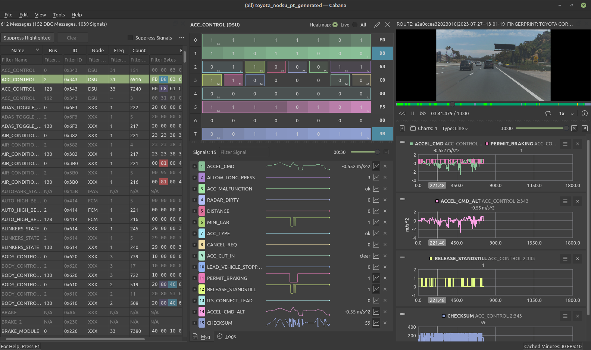

# Cabana

**CAN / CAN FD bus analyzer.** Decode signals, reverse-engineer unknown messages, plot data, and replay drives with synchronized video — all in one tool.

Built-in [OpenDBC](https://github.com/commaai/opendbc) library with 50+ vehicle definitions. Works with ASC, candump, TRC logs, SocketCAN, [Panda](https://github.com/commaai/panda), and [openpilot](https://github.com/commaai/openpilot) routes. MIT licensed.

### Highlights

- **Live bit heatmap** — bit flips flash on change and fade out, instantly revealing active signals
- **Pattern coloring** — bytes auto-colored by trend: increasing, decreasing, toggling, or noisy
- **Find Similar Bits** — discover related signals across messages and buses
- **Find Signal** — search all messages by value range or threshold
- **Bit muting** — suppress known bits to isolate undocumented signals
- **Sparklines** — inline signal previews in the message list
- **Signal charts** — drag-and-drop plotting with multi-column layout and tabs
- **Video sync** — multi-camera playback locked to the CAN timeline
- **Log stitching** — merge multiple log files into one continuous timeline
- **CAN FD** — frames up to 64 bytes
- **DBC editor** — full editing with undo/redo, value tables, and CSV export

### Supported Sources

| Source | Description |
| :--- | :--- |
| **Openpilot route** | Replay a recorded openpilot drive (local or via comma connect) |
| **Vector ASC log** | `.asc` files from CANalyzer, CANoe, or any compatible logger |
| **candump log** | `.log` files recorded with `candump -l` (SocketCAN) |
| **PEAK TRC log** | `.trc` files from PEAK PCAN-View / PCAN-Explorer (v1.x and v2.x) |
| **SocketCAN** | Live capture from a SocketCAN interface (e.g. `can0`) |
| **comma.ai Panda** | Live capture from a USB-connected Panda device |
| **ZMQ / Msgq** | Live streaming from a comma device over the network |

## Prerequisites

Before running or compiling **openpilot-cabana**, install these dependencies.

### Ubuntu / Debian

```bash
sudo apt update
sudo apt install -y g++ clang capnproto libcurl4-openssl-dev libzmq3-dev libssl-dev libbz2-dev libavcodec-dev libavformat-dev libavutil-dev libswscale-dev libavdevice-dev libavfilter-dev libffi-dev libgles2-mesa-dev libglfw3-dev libglib2.0-0 libjpeg-dev libncurses5-dev libusb-1.0-0-dev libzstd-dev libcapnp-dev libx11-dev libxcb1-dev libxcb-xinerama0-dev libxcb-cursor-dev opencl-headers ocl-icd-libopencl1 ocl-icd-opencl-dev qt6-base-dev qt6-tools-dev qt6-tools-dev-tools libqt6charts6-dev libqt6svg6-dev libqt6serialbus6-dev libqt6opengl6-dev

```

## Clone, Compile

### Clone the repository

```bash
git clone https://github.com/deanlee/openpilot-cabana.git
cd openpilot-cabana
git submodule update --init --recursive
```

### Install Python packages

```bash
python3 -m pip install --upgrade pip
python -m pip install --no-cache-dir scons numpy "cython>=3.0" setuptools pycapnp
```

### Build

```bash
scons
```

## Download Precompiled Binary

You can also download a precompiled binary from the [Releases](https://github.com/deanlee/openpilot-cabana/releases) page:

```bash
# Make executable
chmod +x cabana-linux-x86_64

# Run the demo route
./cabana-linux-x86_64 --demo
```

## Usage Instructions

```bash
$ ./cabana -h
Usage: ./cabana [options] route

Options:
  -h, --help                     Displays help on commandline options.
  --help-all                     Displays help including Qt specific options.
  --demo                         use a demo route instead of providing your own
  --auto                         Auto load the route from the best available source (no video):
                                 internal, openpilotci, comma_api, car_segments, testing_closet
  --qcam                         load qcamera
  --ecam                         load wide road camera
  --msgq                         read can messages from msgq
  --panda                        read can messages from panda
  --panda-serial <panda-serial>  read can messages from panda with given serial
  --socketcan <socketcan>        read can messages from given SocketCAN device
  --zmq <ip-address>             read can messages from zmq at the specified ip-address
                                 messages
  --data_dir <data_dir>          local directory with routes
  --no-vipc                      do not output video
  --dbc <dbc>                    dbc file to open

Arguments:
  route                          the drive to replay. find your drives at
                                 connect.comma.ai
```

## Examples

### Running Cabana in Demo Mode
To run Cabana using a built-in demo route, use the following command:

```shell
cabana --demo
```

### Loading a Specific Route

To load a specific route for replay, provide the route as an argument:

```shell
cabana "a2a0ccea32023010|2023-07-27--13-01-19"
```

Replace "0ccea32023010|2023-07-27--13-01-19" with your desired route identifier.


### Running Cabana with multiple cameras
To run Cabana with multiple cameras, use the following command:

```shell
cabana "a2a0ccea32023010|2023-07-27--13-01-19" --dcam --ecam
```

### Streaming CAN Messages from a comma Device

[SSH into your device](https://github.com/commaai/openpilot/wiki/SSH) and start the bridge with the following command:

```shell
cd /data/openpilot/cereal/messaging/
./bridge &
```

Then Run Cabana with the device's IP address:

```shell
cabana --zmq <ipaddress>
```

Replace &lt;ipaddress&gt; with your comma device's IP address.

While streaming from the device, Cabana will log the CAN messages to a local directory. By default, this directory is ~/cabana_live_stream/. You can change the log directory in Cabana by navigating to menu -> tools -> settings.

After disconnecting from the device, you can replay the logged CAN messages from the stream selector dialog -> browse local route.

### Streaming CAN Messages from Panda

To read CAN messages from a connected Panda, use the following command:

```shell
cabana --panda
```

### Opening a Vector ASC Log File

Cabana can open CAN logs recorded in the Vector ASC format (produced by CANalyzer, CANoe, PEAK, and many other tools).

Launch Cabana without arguments and select the **ASC Log** tab in the stream selector, or open multiple files to stitch split logs together automatically:

```shell
cabana
```

Segmented recordings (where a logger restarts timestamps at each file boundary) are stitched seamlessly into a single continuous timeline.

### Opening a candump Log File

Cabana supports logs captured with the Linux `candump` utility using the `-l` (log) flag:

```shell
# Record on the device
candump -l can0
# produces: candump-2026-03-08_120000.log
```

Select the **candump** tab in the stream selector and browse for one or more `.log` files. Multiple files are merged and sorted by timestamp automatically — useful when a long capture is split across several segments.

Each unique CAN interface name in the file (e.g. `can0`, `can1`) is mapped to a separate bus channel.

### Opening a PEAK TRC Log File

Cabana supports CAN logs recorded with PEAK hardware tools such as PCAN-View and PCAN-Explorer.

Both format versions are supported:
- **v1.x** — timestamps are millisecond offsets from log start, single channel
- **v2.x** — timestamps are `hh:mm:ss.sss` wall-clock, with an optional per-frame channel column

Select the **TRC** tab in the stream selector and browse for one or more `.trc` files. Multiple files are stitched automatically, and the channel number (1-based in the file) is mapped to a 0-based bus index in Cabana.

### Using the Stream Selector Dialog

If you run Cabana without any arguments, a stream selector dialog will pop up, allowing you to choose the data source.

```shell
cabana
```

## Binary Activity Analysis

Cabana performs real-time statistical analysis on every byte to help you identify data patterns at a glance.

| Color | Pattern | Meaning |
| :--- | :--- | :--- |
| 🟩 **Green** | **Increasing** | Detected when a byte value is steadily climbing (e.g., a counter). |
| 🟥 **Red** | **Decreasing** | Detected when a byte value is steadily dropping. |
| 🟧 **Amber** | **Toggle** | Identifies bits flipping back and forth between states (e.g., flags). |
| 🟪 **Purple** | **Noisy** | High-entropy data with no discernible trend (e.g., CRC/Encryption). |
| ⬜ **Grey** | **Static** | Indicates data is currently inactive or hasn't changed recently. |

## Contributors

<a href="https://github.com/deanlee/openpilot-cabana/graphs/contributors">
  
</a>
